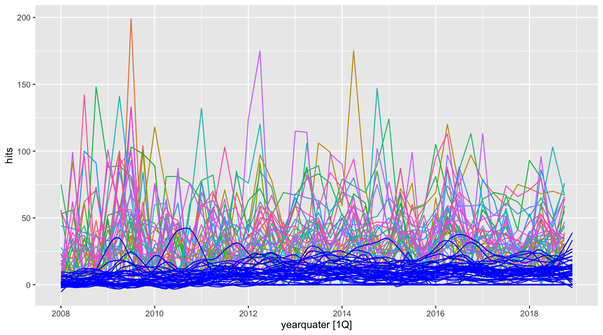
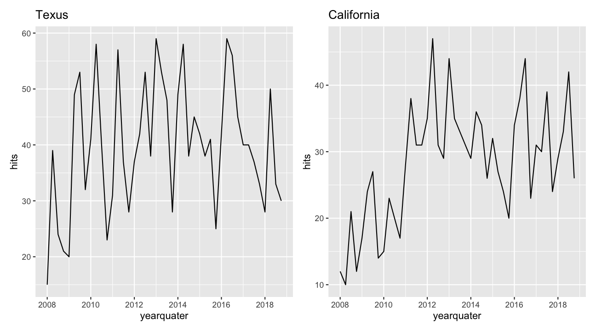

Further\_analysis
================
Steven Lawrence
4/1/2020

# Extracting data using API

## Overall

``` r
 overall_trend <- gtrends(keyword = "skin bleaching", geo = "US", time = "2008-01-01 2018-12-31", low_search_volume = T, gprop = "web")
 

overall_trend$interest_over_time %>% 
   select(date, hits)  %>% 
 # unite("date", date:day,sep = "-") %>% 
        mutate( yearMonth = yearmonth(date)) %>% 
  select(yearMonth, hits,  -date) %>% 
  as_tsibble(index = yearMonth) %>% 
  gg_subseries(hits) +
  labs(y = "Relative Search Volume", x = "")
```

<!-- -->

``` r
overall_trend$interest_over_time %>% 
   select(date, hits)  %>% 
 # unite("date", date:day,sep = "-") %>% 
        mutate( yearMonth = yearmonth(date)) %>% 
  select(yearMonth, hits,  -date) %>% 
  as_tsibble(index = yearMonth) %>% 
  autoplot()+
  labs(y = "Relative Search Volume", x = "")
```

<!-- -->

# State wide

``` r
#Extracting state wide information

statedf <- c(state.abb, "DC") %>% 
  tibble(states = .) %>% 
  mutate(country = rep("US", 51)) %>% 
  select(country, states) %>% 
  unite("region" , country:states,  sep = "-")
##########################################3
states <- read_csv("./statesTS.csv")

names(states) <- substring(names(states), 8)
```

``` r
#adding regions to data set
states %>% 
  #tibble() %>% 
  #unnest() %>% 
  separate(geo, into = c("country","state")) %>% 
  select(date,hits,state) %>% 
  mutate(yearmonth = yearmonth(date)) %>% 
  select(-date) %>% 
  as_tsibble(index = yearmonth, key = state) %>% 
 filter(state %in% c("NY","CA","TX","NJ")) %>% 
  gg_subseries(hits)
```

<!-- -->

``` r
states_q <- states %>% 
  #tibble() %>% 
  #unnest() %>% 
  separate(geo, into = c("country","state")) %>% 
  select(date,hits,state) %>% 
  mutate(yearquater = yearquarter(date)) %>% 
  select(-date) %>% 
  group_by(yearquater, state) %>% 
  summarise(hits = sum(hits)) %>% 
  arrange(state) %>% 
  as_tsibble(index = yearquater, key = state) 

state_region <- tibble(
  name = c(state.name,"DistrictofColumbia"), 
  region = c(as.character(state.region), "South"),   
  state = c(state.abb, "DC")
)

states_q <- left_join(states_q, state_region, by = "state")

states_q %>% 
 filter(state %in% c("NY","CA","TX","NJ")) %>% 
  gg_subseries(hits)
```

<!-- -->

# Decomposition

``` r
dcmp <- states %>% 
 # tibble() %>% 
  #unnest() %>% 
  separate(geo, into = c("country","state")) %>% 
  select(date,hits,state) %>% 
  mutate(yearmonth = yearmonth(date)) %>% 
  select(-date) %>% 
  as_tsibble(index = yearmonth, key = state) %>% 
 #filter(state %in% c("NY","CA","NJ","TX")) %>% 
  model(stl = STL(hits ~ season(window = 13) + trend(window = 10), robust = T)) %>% 
  components() 

states %>% 
#  tibble() %>% 
#  unnest() %>% 
  separate(geo, into = c("country","state")) %>% 
  select(date,hits,state) %>% 
  mutate(yearmonth = yearmonth(date)) %>% 
  select(-date) %>% 
  as_tsibble(index = yearmonth, key = state) %>% 
# filter(state %in% c("NY","CA","NJ","TX")) %>% 
  autoplot(hits) +
  theme(legend.position = "none") +
  autolayer(dcmp, trend,col = "blue", alpha = 2)
```

<!-- -->

``` r
dcmp %>% autoplot()
```

<!-- -->

``` r
states_q %>% 
   autoplot(hits) +
  theme(legend.position = "none") +
  autolayer(dcmp, trend,col = "blue", alpha = 2)
```

<!-- -->

``` r
dcmp2 <- states_q %>% 
  model(stl = STL(hits ~ season(window = 13) + trend(window = 10), robust = T)) %>% 
  components() 


dcmp2 %>% autoplot() +
  theme(legend.position = "none")
```

<!-- -->

``` r
#dcmp %>% gg_subseries(season_year)

#dcmp %>% gg_season(hits, label = "right")
```

# Strongest trend and seasonality

Trend and seasonal strength can help us understand which times series
experienced the most change and the amount of variability within during
the time period.

``` r
`%notin%` <- Negate(`%in%`)

test_s <-  states %>% 
 # tibble() %>% 
 # unnest() %>% 
  separate(geo, into = c("country","state")) %>% 
  select(date,hits,state) %>% 
  mutate(yearmonth = yearmonth(date)) %>% 
  select(-date) %>% 
  as_tsibble(index = yearmonth, key = state) #%>% 
# filter(state %in% c("NY","CA","NJ","TX","MD","DC","NV","GA", "FL","MI"))  
  
#seasonal and trend strength
   
    
  q1 <- states_q %>% #data by quarter
    mutate(region = as_factor(region)) %>% 
  features(hits, feat_stl) %>% 
  ggplot(aes(x = trend_strength, y = seasonal_strength_year)) +
  geom_point(#aes(
  #  col = ifelse(state %in% c("NY","CA","NJ","TX","MD","DC","NV","GA", "FL","MI"), "blue","red"),
  #  col = region)
             ) +
  geom_label_repel(
      aes(label = state ),
        data =  . %>% filter(state  %in% c("NY","CA","NJ","TX","MD","DC","NV","GA", "FL","MI")),
                  box.padding   = 0.35, 
                  point.padding = 0.5,
                  segment.color = 'grey50',
                  size = 3
      ) +
   #   theme(legend.position = "none")+
    scale_fill_viridis_d(aes(col = region))
  
  q2 <- states_q %>% #data by quarter
    mutate(region = as_factor(region)) %>% 
  features(hits, feat_stl) %>% 
  ggplot(aes(x = trend_strength, y = seasonal_strength_year)) +
  geom_point(#aes(
  #  col = ifelse(state %in% c("NY","CA","NJ","TX","MD","DC","NV","GA", "FL","MI"), "blue","red"),
  #  col = region)
             ) +
  geom_label_repel(
      aes(label = state ),
        data =  . %>% filter(trend_strength > 0.6 & seasonal_strength_year > 0.4),
                  box.padding   = 0.35, 
                  point.padding = 0.5,
                  segment.color = 'grey50',
                  size = 3
      ) +
   #   theme(legend.position = "none")+
    scale_fill_viridis_d(aes(col = region))
      ##################################################
    
  
most_seasonal <- states_q %>% 
      features(hits, feat_stl) %>%
      filter(trend_strength %notin% NaN ) %>% 
      filter(seasonal_strength_year == max(seasonal_strength_year))
    
  t1<-  states_q %>% 
      right_join(most_seasonal, by =c("state")) %>% 
      ggplot(aes(x = yearquater, y = hits)) + geom_line()+
      ggtitle("Texus")
    
most_trend <- states_q %>% 
  features(hits, feat_stl) %>% 
       filter(trend_strength %notin% NaN ) %>% 
  filter(trend_strength == max(trend_strength))

  c1<- states_q %>% 
  right_join(most_trend, by = c("state")) %>% 
  ggplot(aes(x = yearquater, y = hits)) + geom_line() +
     ggtitle("California")
  
  q1 + q2 
```

<!-- -->

``` r
  t1 +c1
```

<!-- -->

The plot with the states that have a his SB RSV when utilizing the
regional data set from google trends data, now looking closely at their
indivifual time series, it suggests states such as NJ, MD, DC, NV may
have just always had high SB RSV and are changing as much as the other
labeled states who excibit strong trends (increase) and seasonality
(predictability) over time. The plot on the right depict a few states
with relatively high seasonality and trend which end up all being states
that we identified earlier as states with regional RSV above 72 (3rd
quartile).

States surrounding FL, GA, MI, NY, CA; though they may not be among
those who have high RSV they are interesting still becuase the show
similar levels of trend and seasonal strength. This means that they have
increased the most…..

# A closer look Seasonal features

``` r
#peak hit for each region

                             
test_features <- states_q %>% 
  features(hits, feature_set(pkgs = "feasts"))

# states that don't have information
states_nan <- test_features  %>% 
  filter(is.nan(trend_strength)) %>% 
  select(state) 

# making a data frame that includes regions
#marking problematic states with constant zeroes

test_feature_r <- left_join(test_features, state_region, by= "state" ) %>%
  filter(trend_strength %notin% NaN)

test_feature_r %>%
  select_at(vars(contains("season"), region)) %>%
  mutate(
    seasonal_peak_year = glue::glue("Q{seasonal_peak_year+1}"),
    seasonal_trough_year = glue::glue("Q{seasonal_trough_year+1}"),
  ) %>%
  GGally::ggpairs(mapping = aes(colour=region))
```

<!-- -->

Here I will describe a few plots from the above collection. (i) In the
top right corner we observe that states in the North East have high
seasonal strength compared to the other states with two states from the
south and west regions standing out as outliers. (ii) The bottom plot of
the seaonal peak and seasonal trough confirms eallier findings of peak
seasonas for all states are in the summer and lowest in the winter.

States in the north east, exibit stronger seasonality.

# Using PCA to study time series comparability

Times series have lots of features such as: trend strength, seasonal
strength, linearity, spikiness, curvature, and auto correlation, which
all tell a unique story of the sereies. PCA helps us to reduce the
dimensions of the data to perhaps highlight a new persective of the
data.

``` r
#principal component analysis
pcs <- test_feature_r %>% 
 select(-state, -region, -name ) %>% 
  filter(!is.nan(trend_strength)) %>% 
  prcomp(scale=F) %>% 
  broom::augment(test_feature_r) 

customGreen0 = "#DeF7E9"

customGreen = "#71CA97"

customRed = "#ff7f7f"

head(pcs) %>% 
  select(state, trend_strength, seasonal_strength_year, seasonal_peak_year) %>% 
  formattable(align= c("l","c","c","c"),
              list(`state` = formatter(
              "span", style = ~ style(color = "grey",font.weight = "bold")),
              `trend_strength` = color_bar(customGreen0),
              `seasonal_strength_year` = color_bar(customGreen0))
              
  )
```

<table class="table table-condensed">

<thead>

<tr>

<th style="text-align:left;">

state

</th>

<th style="text-align:center;">

trend\_strength

</th>

<th style="text-align:center;">

seasonal\_strength\_year

</th>

<th style="text-align:center;">

seasonal\_peak\_year

</th>

</tr>

</thead>

<tbody>

<tr>

<td style="text-align:left;">

<span style="color: grey; font-weight: bold">AL</span>

</td>

<td style="text-align:center;">

<span style="display: inline-block; direction: rtl; border-radius: 4px; padding-right: 2px; background-color: #DeF7E9; width: 39.28%">0.3210152</span>

</td>

<td style="text-align:center;">

<span style="display: inline-block; direction: rtl; border-radius: 4px; padding-right: 2px; background-color: #DeF7E9; width: 9.61%">0.05351986</span>

</td>

<td style="text-align:center;">

2

</td>

</tr>

<tr>

<td style="text-align:left;">

<span style="color: grey; font-weight: bold">AR</span>

</td>

<td style="text-align:center;">

<span style="display: inline-block; direction: rtl; border-radius: 4px; padding-right: 2px; background-color: #DeF7E9; width: 25.83%">0.2111337</span>

</td>

<td style="text-align:center;">

<span style="display: inline-block; direction: rtl; border-radius: 4px; padding-right: 2px; background-color: #DeF7E9; width: 43.23%">0.24063737</span>

</td>

<td style="text-align:center;">

3

</td>

</tr>

<tr>

<td style="text-align:left;">

<span style="color: grey; font-weight: bold">AZ</span>

</td>

<td style="text-align:center;">

<span style="display: inline-block; direction: rtl; border-radius: 4px; padding-right: 2px; background-color: #DeF7E9; width: 30.69%">0.2508358</span>

</td>

<td style="text-align:center;">

<span style="display: inline-block; direction: rtl; border-radius: 4px; padding-right: 2px; background-color: #DeF7E9; width: 54.08%">0.30104321</span>

</td>

<td style="text-align:center;">

2

</td>

</tr>

<tr>

<td style="text-align:left;">

<span style="color: grey; font-weight: bold">CA</span>

</td>

<td style="text-align:center;">

<span style="display: inline-block; direction: rtl; border-radius: 4px; padding-right: 2px; background-color: #DeF7E9; width: 100.00%">0.8173091</span>

</td>

<td style="text-align:center;">

<span style="display: inline-block; direction: rtl; border-radius: 4px; padding-right: 2px; background-color: #DeF7E9; width: 100.00%">0.55666069</span>

</td>

<td style="text-align:center;">

2

</td>

</tr>

<tr>

<td style="text-align:left;">

<span style="color: grey; font-weight: bold">CO</span>

</td>

<td style="text-align:center;">

<span style="display: inline-block; direction: rtl; border-radius: 4px; padding-right: 2px; background-color: #DeF7E9; width: 24.54%">0.2005777</span>

</td>

<td style="text-align:center;">

<span style="display: inline-block; direction: rtl; border-radius: 4px; padding-right: 2px; background-color: #DeF7E9; width: 49.56%">0.27587114</span>

</td>

<td style="text-align:center;">

2

</td>

</tr>

<tr>

<td style="text-align:left;">

<span style="color: grey; font-weight: bold">CT</span>

</td>

<td style="text-align:center;">

<span style="display: inline-block; direction: rtl; border-radius: 4px; padding-right: 2px; background-color: #DeF7E9; width: 40.45%">0.3305664</span>

</td>

<td style="text-align:center;">

<span style="display: inline-block; direction: rtl; border-radius: 4px; padding-right: 2px; background-color: #DeF7E9; width: 24.10%">0.13416575</span>

</td>

<td style="text-align:center;">

3

</td>

</tr>

</tbody>

</table>

## volcano plot

In these two plots we observe how relatable are the SB time series by
state (left plot) and region (right plot).

``` r
# How related are the time series

s1 <- pcs %>% 
  mutate(state = as_factor(state)) %>% 
  ggplot( aes(x = .fittedPC1,
             y = .fittedPC2, 
             group = ifelse(state %in% c("NY","CA","NJ","TX","MD","DC","NV","GA", "FL","MI"),"red","black" ),
             col = region
             )
    ) +
   geom_point(aes(label = state #,
                  #col = ifelse(state %in% c("NY","CA","NJ","TX","MD","DC","NV","GA", "FL","MI"),"red","black" )
                  )
                  )+ 
   geom_label_repel(
     data =  . %>% filter(state  %in% c("NY","CA","NJ","TX","MD","DC","NV","GA", "FL","MI")),
                  aes(label = state),
                  box.padding   = 0.5, 
                  point.padding = 0.5,
                  segment.color = 'grey50',
                  size = 2) +
  theme(legend.position = "none", aspect.ratio = 1)

r1 <- pcs %>% 
  ggplot(aes(x = .fittedPC1, y =.fittedPC2, col = region)) +
  geom_point() + 
  geom_label_repel(aes(label = state),
                   data =  . %>% filter(.fittedPC1 > 4000 | .fittedPC2 < -500),
                  box.padding   = 0.35, 
                  point.padding = 0.5,
                  segment.color = 'grey50',
                  size = 2) +
theme(legend.position = "right",
      aspect.ratio = 1)


s1 + r1 
```

<!-- -->

PC1 and PC2 explain most amount of variability among all the features in
these time series plots. Here we observe a cluster of states that become
slightly less related, then 3 outliers that are drastically different
than the others. The cluster of states suggest have the most reliable
information and suggests that states with highest similarities are most
likely to have similar trends and seasonality or even peak at the same
times. The outliers include the states Rhode Island, Wisconsin, and
Arizona which will be further analyized.

# Time Series Ouliers

Taking a look at the three outliers observed above. The resolution of
the data is summed by quarter there I devided by the max summed RSV for
each quarter to maintain proportions to normal RSV.

``` r
# extracting outliers
outliers <- pcs %>%
  filter(.fittedPC1 > 4000 | .fittedPC2 < -500)

#ploting outliers
outliers %>% left_join(states_q, by = c("state","region")) %>% 
  mutate(series = glue("{state}","{region}", .sep = "\n")) %>% 
  ggplot(aes(x = yearquater, y = hits/max(hits)))+geom_line()+
  facet_grid(series ~.)+
  ggtitle("Outlying time series in PC space")
```

<!-- -->

From these plots we can observe a few things: (i) Arizona’s time series
obviously has a strong influential point in the 3 quarter of the year
2009 which can be highly attributed to the rise in iterest of Michael
Jackson’s death, being a celebrity with his known status of having
Viteligo which is highly associated with skin bleaching. (ii) Rhode
Islands circuit breaker “on and off” type of series suggests that SBL
RSV is not reliably meeting the threshold of forseable interest and
lacks seasonality as most other states do. However, it starts to exibit
seasonality at the far end after 2016 which suggest the SBL RSV in Rhode
Island is more reliable after that date. (iii) Lastly, Wisconsins SBL
RSV becomes more reliable after 2010 and I believe is so differenct
because of its lack of seasonality for a term that is general refered to
as a seasonal behavior in the literature. The more seasonal, the more
reliable the data is becuase it increase the feasability of prediction.
